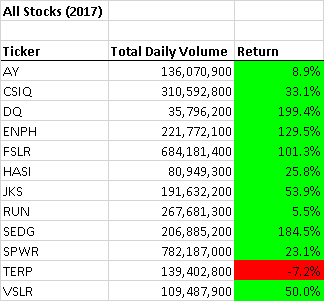
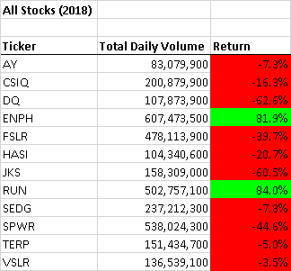
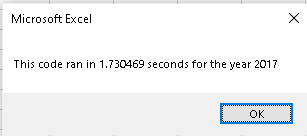
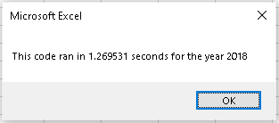
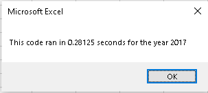
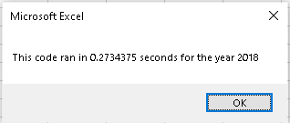

# <u>Stock Analysis</u>

### <u>Project Overview</u>

An analysis of green energy stocks was prepared to compare how they performed in 2017 and 2018.  A dataset that contained data about several stocks was utilized to perform the analysis.  Two main pieces of information were generated for each year for all the tickers in the database, see the list below.

* ###### Total Daily Volume

  * Calculated by summing the all of daily Volume records for each ticker.

* ###### Percentage of Return

  * calculated by taking the Closing value from the first available date and dividing that by the Closing value from the last available date for each ticker.

These two pieces of information were used to see more clearly if there is a relationship between volume and rate of return across multiple years.

### <u>Results</u>

Below are the results of the analysis.

For 2017



For 2018



As you can see all but one of the stocks performed better in 2017 than in 2018.  We can also see that there does not seem to be a strong correlation between volume and rate of return.


##### The Code

The analysis is run using VBA for Excel.  The Code created to run the analysis consists of  four arrays, listed below.

1. An array to hold the stocks ticker information which was hard coded.

   ```vbscript
   Dim tickers(12) As String
   
   tickers(0) = "AY"
   tickers(1) = "CSIQ"
   tickers(2) = "DQ"
   tickers(3) = "ENPH"
   tickers(4) = "FSLR"
   tickers(5) = "HASI"
   tickers(6) = "JKS"
   tickers(7) = "RUN"
   tickers(8) = "SEDG"
   tickers(9) = "SPWR"
   tickers(10) = "TERP"
   tickers(11) = "VSLR"
   ```

2. An array to hold Volume information, this information was captured from the database using the following code.

```vbscript
        If Cells(i, 1).Value = tickers(tickerIndex) Then

        tickerVolumes(tickerIndex) = tickerVolumes(tickerIndex) + Cells(i, 8).Value

        End If
```
3. An array to capture the starting price of the stock

4. An array to capture the ending price of the stock.

   * The information populating these arrays was captured from the database using the following code.

     ```vbscript
        '3b) Check if the current row is the first row with the selected tickerIndex.
     
             If Cells(i - 1, 1).Value <> tickers(tickerIndex) And Cells(i, 1).Value = tickers(tickerIndex) Then
     
                tickerStartingPrice(tickerIndex) = Cells(i, 6).Value
     
             End If
             
         '3c) check if the current row is the last row with the selected ticker
         
             If Cells(i + 1, 1).Value <> tickers(tickerIndex) And Cells(i, 1).Value = tickers(tickerIndex) Then
     
                tickerEndingPrice(tickerIndex) = Cells(i, 6).Value
     ```

   * Both of these arrays were used to calculate the percentage return using the following code.

     ```vbscript
     Cells(4 + j, 3).Value = tickerEndingPrice(j) / tickerStartingPrice(j) - 1
     ```

A loop is utilized to iterate through the data and populate all the arrays.  Finally a second loop is utilized to push all of the information into the Excel Workbook as illustrated in the beginning of this section.

##### Speed Test

This code was written twice to show two different methods to get similar results.  Actually the only difference between the two methods as far as results are concerned was execution time.

* The first time the code was written Nested loops were utilized, The illustrations  below show execution time for this method.






* The next two images show the execution time after the code was refactored.  This method eliminated the nested loop.





As you can see, the second method significantly improved execution time.

### <u>Summary</u>

Advantages of refactoring the code.

* The code execute much faster.
* The code is more easily read.

I was unable to identify any significant disadvantages to refactoring the code.

